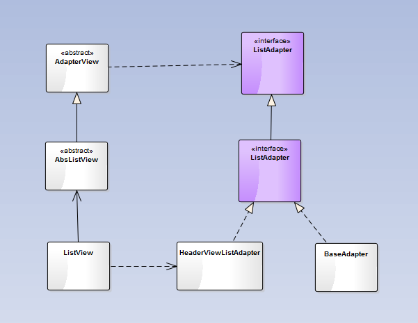

### ListView相关基本类的继承关系

以上为基本继承关系图，AdapterView与Adapter之间使用了桥接模式，该模式可以适应两端的同时变化

#### 伪代码
* ViewGroup的伪代码
<pre><code>
	dispatchTouchEvent(event){
		If(!disallowIntercept){
			interceptTouchEvent();-------------------------------调用拦截方法
	}
	…
	for(倒序遍历所有子控件){
		if(当前时间的坐标在该子控件范围内){
			mTargetView=该子控件;
			break;
	}
	}
	…
	If(mTargetView==null){
		handle=Super.dispatchTouchEvent();--------------调用父类的分发，即View的分发事件
	}else{
		handle=mTargetView.dispatchTouchEvnet();----调用子控件的分发
	}
	…
	onTouchEvent();
	return handle;------------------------------------------------此处的返回值会影响目标控件的确定
	}

</code></pre>
* View的伪代码
<pre><code>
	dispatchTouchEvent(event){
		if(设置OnTouchListener并且消费事件){
			reslut=true;
	}
	if(!reslut&&onTouchEvent()){-----------------------调用onTouchEvent方法，消费则结果为true
		reslut=true
	}
	return result;--------------------------------------------此处的返回值会影响目标控件的确定
	}

</code></pre>
#### 结论
1. 只有在dispatchTouchEvent和onTouchEvent方法中的Action_Down事件才能确定目标控件
2. 只能在onInterceptTouchEvent方法中才能修改目标控件，且拦截的控件会发个Action_Cancel给子控件，并将拦截的事件交给Activity
3. 如果确定了目标控件，dispatchTouchEvent和onTouchEvent返回false，那么事件交给Activity
4. 如果没有确定目标控件，dispatchTouchEvent和onTouchEvent返回false，那么事件交给父控件

### 绘制流程
<pre><code>
View:
		draw(){
			//绘制背景
			drawBackground();
			//绘制自定义的内容区域（自定义控件常用）
			onDraw();
			//绘制子控件
			dispatchDraw();//这里为空方法
			//绘制前景
			onDrawForeground(){
				//绘制滑动指示器
				onDrawScrollIndicators();
				//绘制滑动条
				onDrawScrollBars(){
					//绘制水平滑动条
					onDrawHorizontalScrollBar();
					//绘制竖直滑动条
					onDrawVectialScrollBar();
				};
			};
		}
		ViewGroup:
			dispatchDraw();//主要住了写动画及动画监听器
		AbsListView:
			draw(){
				//绘制贝塞尔曲线
				...
			}
		ListView:
			dispatchDraw(){
				//绘制OverScroll滑出时上下两张图片
				drawOverScrollHeader();
				drawOverScrollFooter();
				//绘制分割线
				drawDivider();
				//调用父类
				super.dispatchDraw();
			}

</code></pre>

### 回收机制

1. 熟悉ListView的继承关系：
AdatperView-->AbsListView-->ListView
2. 了解ListView继承关系中各类、接口的分工：
	- AdapterView负责观察者模式，如：notifyDataSetChenged()方法通知ListView数据改变，就是在这里实现
	- AbsListView负责子视图回收，如：RecycleBin的处理
	- ListView负责显示数据
3. 观察者模式的继承结构：
	- 观察者管理类：Observable-->DataSetObservable
	- 观察者类:DataSetObserver-->AdapterDataSetObserver
	- 观察对象：AdatperView-->AbsListView-->ListView

主要查看AbsListView中的内部类RecycleBin
主要有三个成员变量

* mViewTypeCount：ListView中item的类型种类，RecycleBin会根据这个值创建回收集合数组，一种类型对应一个回收集合
* mScrapViews：ListView中的回收集合
* 当ListView中的某个item滑出ListView范围时，ListView根据该item对应的position判断item的类型，从而放入到回收集合数组中对应的集合中；当ListView需要添加item时，首先从回收集合数组中获取对应的item类型，若集合中有缓存的，取出给ListView，若没有，则ListView自己创建item。

### 数据更新
* 观察者管理类：Observable-->DataSetObservable
* 观察者类:DataSetObserver-->AdapterDataSetObserver
* 观察对象：AdatperView-->AbsListView-->ListView

### 上拉刷新、下拉加载、OverScroll回弹

* 方法1：通过改变ListView的paddingTop/paddingBottom两个属性的值实现
* 方法2：给L istView加入一个头部和一个脚部，并通过改变该头部、脚部的大小来实现（见XlistView）
方法3：将ListView放到一个容器ViewGroup中，通过控制ListView在ViewGroup的位置实现（将PtrListView）

### 分组悬停
#### 方案1：使用FrameLayout容器
> 里面两个子控件（ListView,View/Text），如StickyListView

1. ListView
2. View/Text：实现悬浮固定标题，该控件有且只会存在一个（相当于单例模式），只有当分组的首个Item滑动到顶部时，才会显示出来

##### 条目Item的类型为WrapperView，继承自ViewGroup
> 包含两个子控件:Header、SubItem
> ListView通过改变Item的两个子控件的显示状态（Visiable、gone）来实现显示效果的两种类型

##### 事件
1. Header的单击事件：将事件绑定到Header控件上
2. SubItem的点击事件：将事件绑定到Item上
  
当以上两个点击发生事件冲突时，首先会优先处理Header的点击事件，所以当点击在Header控件上时，响应的是OnHeaderClickListener，当点击在Item的其他位置时，响应的是OnItemClickListener

##### Header
> 只有当分组中的第一个SubItem滑到顶部时，该控件才会创建，且内容该分组中的Header控件一样，并且是失踪悬浮在StickyListView的顶 部，知道下个分组将其推出StickyListView的显示区域

#### 方案2：直接在ListView中绘制
> 在ListView中的dispatchDraw()方法中绘制出该标题控件Header，因为该Header需要悬浮在ListView的子控件上方，故绘制的时序在绘制子控件之后