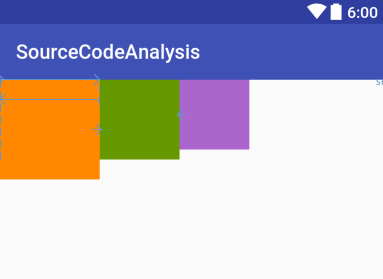

### RelativeLayout

#### 依赖关系优先级
    

```
<!--android:layout_toRightOf="@id/second"优先级次低-->
<!--android:layout_alignLeft="@id/second"优先级次高-->
<!--android:layout_alignParentLeft="true"优先级最高-->
<!--android:layout_centerHorizontal="true"优先级最低-->
```


```
<RelativeLayout
    xmlns:android="http://schemas.android.com/apk/res/android"
    android:layout_width="match_parent"
    android:layout_height="match_parent"
    android:orientation="vertical">

    <TextView
        android:id="@+id/first"
        android:layout_width="100dp"
        android:layout_height="100dp"
        android:background="@android:color/holo_orange_dark"/>

    <TextView
        android:id="@+id/second"
        android:layout_width="90dp"
        android:layout_height="90dp"
        android:layout_toRightOf="@id/first"
        android:background="@android:color/holo_blue_dark"
        android:visibility="visible"/>

    <TextView
        android:id="@+id/third"
        android:layout_width="80dp"
        android:layout_height="80dp"
        android:layout_centerHorizontal="true"
        android:background="@android:color/holo_green_dark"/>
    
</RelativeLayout>
```
效果图：


给第三个TextView增加

```
android:layout_toRightOf="@id/second"
```
属性后，效果图：


给第三个TextView在增加


```
android:layout_alignLeft="@id/second"
```
属性后，效果图：


给第三个TextView又一次增加


```
android:layout_alignParentLeft="true"
```
属性后，效果图：


#### 依赖链传递


```
<RelativeLayout
    xmlns:android="http://schemas.android.com/apk/res/android"
    android:layout_width="match_parent"
    android:layout_height="match_parent"
    android:orientation="vertical">

    <TextView
        android:id="@+id/first"
        android:layout_width="100dp"
        android:layout_height="100dp"
        android:background="@android:color/holo_orange_dark"
        android:visibility="visible"/>

    <TextView
        android:id="@+id/second"
        android:layout_width="90dp"
        android:layout_height="90dp"
        android:layout_toRightOf="@id/first"
        android:background="@android:color/holo_blue_dark"
        android:visibility="visible"/>

    <TextView
        android:id="@+id/third"
        android:layout_width="80dp"
        android:layout_height="80dp"
        android:layout_toRightOf="@id/second"
        android:background="@android:color/holo_green_dark"/>

    <TextView
        android:id="@+id/fourth"
        android:layout_width="70dp"
        android:layout_height="70dp"
        android:layout_toRightOf="@id/third"
        android:background="@android:color/holo_purple"/>

</RelativeLayout>
```
这里四个TextView都是下一个放置在上一个的右边，即下一个依赖上个。
效果图：


将第二个TextView的visibility=“gone”后的效果图：



通过上面两个图比较，third应该布局在second的右边，但是second为gone，只是third会找到second通过layout_toRightOf依赖的first，因此third此时不知在first右边。