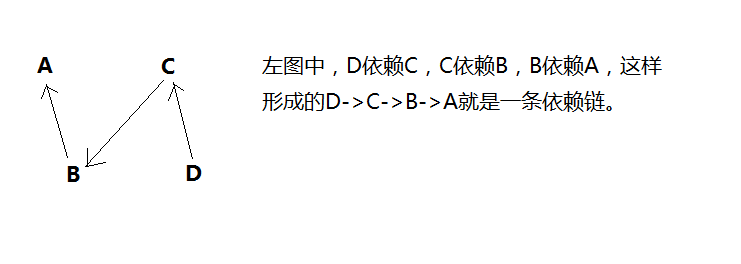
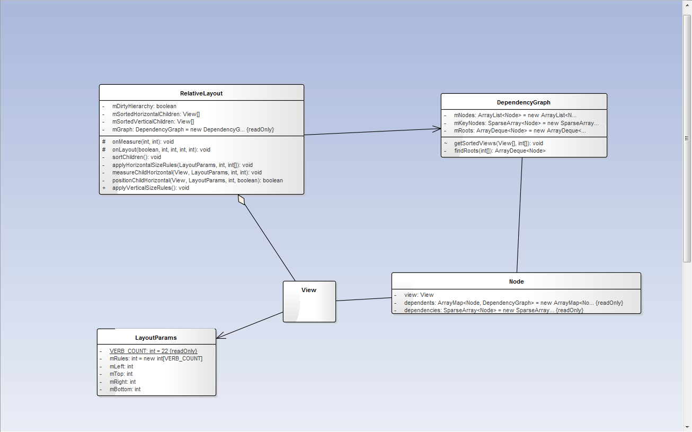

## RelativeLayout
---

依赖链网上传递

依赖规则的优先级

### onMeasure()方法分析

在分析之前，先介绍RelativeLayout中几个成员变量的含义：
* private boolean mDirtyHierarchy;//子控件层次结构是否"脏"
* private View[] mSortedHorizontalChildren;//对子控件水平方向排序后的子控件数组
* private View[] mSortedVerticalChildren;//对子控件竖直方向排序后的子控件数组
* private final DependencyGraph mGraph = new DependencyGraph();//子控件之间的依赖关系图

这里将omMeasure()方法中的代码分成几部分分析。

### 第一部分**

<pre><code>
        //层次结构是否发生改变
        if (mDirtyHierarchy) {
            mDirtyHierarchy = false;
            sortChildren();//层次结构已改变，需要重新对子控件排序
        }
</code></pre>
在该代码中，mDirtyHierarchy表示子控件的依赖层次结构是否变化了。若为true表示变化了，则需要对子控件的依赖层次结构重新排序。即这里调用了sortChildren()方法来实现排序。下面是该方法的代码：

<pre><code>
private void sortChildren() {
        final int count = getChildCount();
        if (mSortedVerticalChildren == null || mSortedVerticalChildren.length != count) {
            mSortedVerticalChildren = new View[count];
        }

        if (mSortedHorizontalChildren == null || mSortedHorizontalChildren.length != count) {
            mSortedHorizontalChildren = new View[count];
        }

        final DependencyGraph graph = mGraph;
        graph.clear();//清空之前的依赖关系

        for (int i = 0; i < count; i++) {
            graph.add(getChildAt(i));
        }
		//子控件按水平方向排序
        graph.getSortedViews(mSortedVerticalChildren, RULES_VERTICAL);
		//子控件按竖直方向排序
        graph.getSortedViews(mSortedHorizontalChildren, RULES_HORIZONTAL);
    }
</code></pre>
sortChildren()方法中，做了如下操作：
* 清空依赖关系图（依赖关系已经发生改变）
* 将所有子控件构成的Node加入到依赖关系图mGraph中
* 对依赖关系图中Node（由子控件的id位移标示）集合按竖直方向排序，排序后的结果存入成员变量mSortedVerticalChildren中
* 对依赖关系图中Node集合按水平方向排序，排序后的结果存入成员变量mSortedHorizontalChildren中

这里调用了DependencyGraph类的方法对Node排序，代码如下：

<pre><code>
//将图转化为队列
        void getSortedViews(View[] sorted, int... rules) {
        	//找到不依赖别的控件的控件集合，作为根节点
            final ArrayDeque<Node> roots = findRoots(rules);
            int index = 0;

            Node node;
			//遍历根节点集合,根节点集合中最后一个开始移除。
			//根节点集合roots在下面的while循环中并不是一直减少，可能在增加(当一个普通节点移除所有关系之后就变成了根节点，
			//并会加入到该集合中)
            while ((node = roots.pollLast()) != null) {
                final View view = node.view;
                final int key = view.getId();
				//将根节点(包括取出依赖关系之后变成的根节点)加入到排序集合中，
				//此集合中排在前面的节点不依赖排在后面的节点，排在后面的节点可能依赖前面的一个或者多个节点
                sorted[index++] = view;
				//获得依赖根节点的节点集合
                final ArrayMap<Node, DependencyGraph> dependents = node.dependents;
                final int count = dependents.size();
				//遍历依赖节点
                for (int i = 0; i < count; i++) {
                    final Node dependent = dependents.keyAt(i);
                    final SparseArray<Node> dependencies = dependent.dependencies;
					//移除其中一个依赖节点与该根节点的关系
                    dependencies.remove(key);
					//当节点denpendent所有的依赖关系全部移除后，那么denpendent也成为了根节点，加入到根节点集合
                    if (dependencies.size() == 0) {
                        roots.add(dependent);
                    }
                }
            }

            if (index < sorted.length) {
                throw new IllegalStateException("Circular dependencies cannot exist"
                        + " in RelativeLayout");
            }
        }
</code></pre>

在getSortedViews()方法中做了如下操作：
* 找到根节点（集合），根节点的定义：不依赖其他子节点的节点
* 遍历根节点集合，使用栈的方式弹出最后一个根节点
* - 遍历依赖该根节点的节点集合，并一条条取出该节点与根节点的依赖关系
* - 当该节点依赖关系数量为0时（即此时已经不依赖其他节点），该节点也成为了根节点，并加入到根节点集合中
* - 将没有依赖关系的View加入后排序后的结果数组sorted中

**注意：在遍历的过程中，根节点集合中元素数量并不是一直减少，可能某次循环会增多，因为随着依赖关系的减少，会出现新的节点**

**上面的while循环中的代码，就是一个“图”转成“队列”的过程**，简单过程如下：

**DependencyGraph**

成员变量：
* private ArrayList<Node> mNodes = new ArrayList<Node>();依赖关系图中的所有View的集合
* private SparseArray<Node> mKeyNodes = new SparseArray<Node>();依赖关系图中的节点集合，每个节点被它的View的id唯一标示

**Node**

成员变量：
* View view；组成节点的View
* final ArrayMap<Node, DependencyGraph> dependents =new ArrayMap<Node, DependencyGraph>();
* final SparseArray<Node> dependencies = new SparseArray<Node>();依赖该节点的节点集合

在getSortedViews开头调用了findRoots()方法查找根节点，下面是findRoots()的代码：

<pre><code>
//找到依赖关系的根节点
        private ArrayDeque<Node> findRoots(int[] rulesFilter) {
            final SparseArray<Node> keyNodes = mKeyNodes;
            final ArrayList<Node> nodes = mNodes;
            final int count = nodes.size();

            // Find roots can be invoked several times, so make sure to clear
            // all dependents and dependencies before running the algorithm
            //计算之前，清空上次计算的数据
            for (int i = 0; i < count; i++) {
                final Node node = nodes.get(i);
                node.dependents.clear();
                node.dependencies.clear();
            }

            // Builds up the dependents and dependencies for each node of the graph
            //创建依赖关系图中每隔节点的依赖和被依赖的关系集合
            for (int i = 0; i < count; i++) {
                final Node node = nodes.get(i);

                final LayoutParams layoutParams = (LayoutParams) node.view.getLayoutParams();
				//当前节点(控件)的所有依赖关系(mRules长度为22，对应22中依赖关系)
                final int[] rules = layoutParams.mRules;
				//rulesFilter过滤依赖关系(例如，过滤出水平依赖关系)
                final int rulesCount = rulesFilter.length;

                // Look only the the rules passed in parameter, this way we build only the
                // dependencies for a specific set of rules
                //遍历当前节点的所有依赖(xml中没有设置的依赖关系会有一个默认值)
                for (int j = 0; j < rulesCount; j++) {
                    final int rule = rules[rulesFilter[j]];
                    if (rule > 0) {
                        // The node this node depends on
                        //获取当前节点依赖的节点
                        final Node dependency = keyNodes.get(rule);
                        // Skip unknowns and self dependencies
                        //去除未知、自我依赖的依赖关系
                        if (dependency == null || dependency == node) {
                            continue;
                        }
                        // Add the current node as a dependent
                       	//dependents存放依赖当前节点的节点集合
                        dependency.dependents.put(node, this);
                        // Add a dependency to the current node
                        //存放当前节点依赖的其他节点，这些别依赖的节点与依赖规则的集合
                        node.dependencies.put(rule, dependency);
                    }
                }
            }

            final ArrayDeque<Node> roots = mRoots;
            roots.clear();//清空上次计算的根节点

            // Finds all the roots in the graph: all nodes with no dependencies
            //遍历所有节点，找出根节点(根节点不依赖其他节点，即没有依赖关系)
            for (int i = 0; i < count; i++) {
                final Node node = nodes.get(i);
				//若该节点没有依赖其他节点，则该节点为根节点
                if (node.dependencies.size() == 0) roots.addLast(node);
            }

            return roots;
        }
</code></pre>

该方法有一个参数rulesFilter，是一个int数组，用来过滤依赖关系的。在这里有必要介绍一下RelativeLayout.LayoutParams这个内部类。

有几个关键成员变量：
* int[] mRules = new int[VERB_COUNT];存储RelativeLayout中子控件的依赖关系的数组，长度为VERB_COUNT，值为22，对应RelativeLayout中定义的22个常量：LEFT_OF/RIGHT_OF/ALIGN_LEFT/ALIGN_RIGHT等。
* int mLeft, mTop, mRight, mBottom;存储RelativeLayout中子控件的上下左右四条边界，后面会通过子控件的依赖关系计算出来，并在onLayout()方法中使用。

在竖直排序时，该rulesFilter的值为水平依赖关系组成的int数组，即在排序时，只会考虑竖直方向的依赖关系，这样就实现竖直方向的排序。
在水平排序时，该relesFilter的值为水平依赖关系组成的int数组，即在排序时，只会考虑水平方向的依赖关系，这样就实现水平方向的排序。

该方法中，分析：
* 清空上次计算的数据，即依赖与被依赖的关系
* 从子控件的LayoutParams中获得所有的依赖关系，并通过rulesFilter过滤出水平后者竖直方向的依赖关系。
* 遍历这些依赖关系，并将依赖关系存入子控件节点中。
* 遍历节点，找出不依赖其他节点的节点，这些节点即为根节点。

### 第二部分
与第二部分中间略去了部分代码

<pre><code>
        //遍历子控件的水平关系
        View[] views = mSortedHorizontalChildren;
        int count = views.length;

        for (int i = 0; i < count; i++) {
            View child = views[i];
            if (child.getVisibility() != GONE) {
                LayoutParams params = (LayoutParams) child.getLayoutParams();
				//根据方向获得子view中设置的规则
                int[] rules = params.getRules(layoutDirection);
				//把这些左右方向的规则转化成左右坐标
                applyHorizontalSizeRules(params, myWidth, rules);
				//测算子控件在水平方向上的尺寸
                measureChildHorizontal(child, params, myWidth, myHeight);
				//确定子控件在RelativeLalyout水平方向上的位置
                if (positionChildHorizontal(child, params, myWidth, isWrapContentWidth)) {
                    offsetHorizontalAxis = true;
                }
            }
        }
</code></pre>
这部分代码功能：对子控件进水平方向的测量
此时mSortedHorizontalChildren集合中的子控件已经经过排序，后面的子控件依赖前面的自控家，前面的子控件不依赖后面的子控件。
* 获得子控件的水平依赖关系
* 根据这些水平依赖关系计算出子控件的水平边界（左边界childLeft、右边界childRight）
* 水平方向上测量子控件
* 对没有设置依赖或者水平居中的子控件计算水平边界

第二部分代码中调用了applyHorizontalSizeRules(...)、measureChildHorizontal(...)和positionChildHorizontal(...)三个方法

##### applyHorizontalSizeRules(...)

<pre><code>
//通过依赖关系计算出控件在水平方向上的大小位置
    private void applyHorizontalSizeRules(LayoutParams childParams, int myWidth, int[] rules) {
        RelativeLayout.LayoutParams anchorParams;

        // VALUE_NOT_SET indicates a "soft requirement" in that direction. For example:
        // left=10, right=VALUE_NOT_SET means the view must start at 10, but can go as far as it
        // wants to the right
        // left=VALUE_NOT_SET, right=10 means the view must end at 10, but can go as far as it
        // wants to the left
        // left=10, right=20 means the left and right ends are both fixed
        childParams.mLeft = VALUE_NOT_SET;
        childParams.mRight = VALUE_NOT_SET;
		//获取LEFT_OF依赖控件的LayoutParams对象，计算该子控件的右边界mRight值，若没有依赖节点，则参考RelativeLalyout
        anchorParams = getRelatedViewParams(rules, LEFT_OF);
        if (anchorParams != null) {
			//在依赖控件左边:右边界=依赖控件的左边界-(依赖控件的左margin+控件的右margin)
            childParams.mRight = anchorParams.mLeft - (anchorParams.leftMargin +
                    childParams.rightMargin);
        } else if (childParams.alignWithParent && rules[LEFT_OF] != 0) {
        	//相对RelativeLayout右对齐:右边界=RelativeLayout右边界-RelativeLayout的右padding-控件的右margin
            if (myWidth >= 0) {
                childParams.mRight = myWidth - mPaddingRight - childParams.rightMargin;
            }
        }

		//RIGHT_OF同LEFT_OF，计算子控件的左边界mLeft值，若没有依赖节点，则参考RelativeLalyout
        anchorParams = getRelatedViewParams(rules, RIGHT_OF);
        if (anchorParams != null) {
            childParams.mLeft = anchorParams.mRight + (anchorParams.rightMargin +
                    childParams.leftMargin);
        } else if (childParams.alignWithParent && rules[RIGHT_OF] != 0) {
            childParams.mLeft = mPaddingLeft + childParams.leftMargin;
        }

		//获取ALIGN_LEFT依赖控件的依赖参数，计算子控件的左边界mLeft值，该值会覆盖RIGHT_OF中计算的值
        anchorParams = getRelatedViewParams(rules, ALIGN_LEFT);
        if (anchorParams != null) {
            childParams.mLeft = anchorParams.mLeft + childParams.leftMargin;
        } else if (childParams.alignWithParent && rules[ALIGN_LEFT] != 0) {
            childParams.mLeft = mPaddingLeft + childParams.leftMargin;
        }

		//ALIGN_RIGHT同ALIGN_LEFT
        anchorParams = getRelatedViewParams(rules, ALIGN_RIGHT);
        if (anchorParams != null) {
            childParams.mRight = anchorParams.mRight - childParams.rightMargin;
        } else if (childParams.alignWithParent && rules[ALIGN_RIGHT] != 0) {
            if (myWidth >= 0) {
                childParams.mRight = myWidth - mPaddingRight - childParams.rightMargin;
            }
        }

		//子控件与父控件左对齐，计算子控件的左边界mLeft值，该值会覆盖之前计算的值，即这里优先级更高
        if (0 != rules[ALIGN_PARENT_LEFT]) {
            childParams.mLeft = mPaddingLeft + childParams.leftMargin;
        }

		//同上
        if (0 != rules[ALIGN_PARENT_RIGHT]) {
            if (myWidth >= 0) {
                childParams.mRight = myWidth - mPaddingRight - childParams.rightMargin;
            }
        }
    }
</code></pre>

功能：根据该子控件的LEFT_OF/RIGHT_OF/ALIGN_LEFT/ALIGN_RIGHT/ALIGN_PARENT_LEFT/ALIGN_PARENT_RIGHT确定子控件的水平边界（childLeft、childRight）

**注意：以上几种关系的优先级**
* <!--android:layout_alignLeft="@id/second"优先级次低-->
* <!--android:layout_toRightOf="@id/second"优先级次高-->
* <!--android:layout_alignParentLeft="true"优先级最高-->
* <!--android:layout_centerHorizontal="true"优先级最低-->

其中调用了getRelatedView(...)方法，其中又会调用getRelatedView(...)方法

<pre><code>
    //获取通过指定依赖关系的依赖控件的布局参数
    private LayoutParams getRelatedViewParams(int[] rules, int relation) {
        View v = getRelatedView(rules, relation);
        if (v != null) {
            ViewGroup.LayoutParams params = v.getLayoutParams();
            if (params instanceof LayoutParams) {
                return (LayoutParams) v.getLayoutParams();
            }
        }
        return null;
    }
    
    
    //获取指定依赖关系的依赖控件
    private View getRelatedView(int[] rules, int relation) {
        int id = rules[relation];
        if (id != 0) {
            DependencyGraph.Node node = mGraph.mKeyNodes.get(id);
            if (node == null) return null;
            View v = node.view;

            // Find the first non-GONE view up the chain
            //沿着依赖链网上寻找不为gone的节点
            //假设当前节点为A，A依赖节点B，B依赖节点C，若B节点为gone，那么就会找到C节点，此时A则会判定为依赖C
            while (v.getVisibility() == View.GONE) {
                rules = ((LayoutParams) v.getLayoutParams()).getRules(v.getLayoutDirection());
                node = mGraph.mKeyNodes.get((rules[relation]));
                if (node == null) return null;
                v = node.view;
            }

            return v;
        }

        return null;
    }
</code></pre>

在getRelatedView()方法中，有一个依赖链的问题。

当寻找D的依赖对象时，首先会找到C，但是如果C设置为gone，那么就会忽略C，继续寻找C的依赖B,此时就会把B当前D的依赖来计算D的位置。

##### measureChildHorizontal(...)

<pre><code>
    private void measureChildHorizontal(
            View child, LayoutParams params, int myWidth, int myHeight) {
            //根据前面计算的子控件的左边界mLeft、右边界mRight，得出子控件的WidthMeasureSpec
        final int childWidthMeasureSpec = getChildMeasureSpec(params.mLeft, params.mRight,
                params.width, params.leftMargin, params.rightMargin, mPaddingLeft, mPaddingRight,
                myWidth);

        final int childHeightMeasureSpec;
        if (myHeight < 0 && !mAllowBrokenMeasureSpecs) {
            if (params.height >= 0) {
                childHeightMeasureSpec = MeasureSpec.makeMeasureSpec(
                        params.height, MeasureSpec.EXACTLY);
            } else {
                // Negative values in a mySize/myWidth/myWidth value in
                // RelativeLayout measurement is code for, "we got an
                // unspecified mode in the RelativeLayout's measure spec."
                // Carry it forward.
                childHeightMeasureSpec = MeasureSpec.makeMeasureSpec(0, MeasureSpec.UNSPECIFIED);
            }
        } else {
            final int maxHeight;
			//计算子控件的高度值，去除父控件的padding值、自己的margin值
            if (mMeasureVerticalWithPaddingMargin) {
                maxHeight = Math.max(0, myHeight - mPaddingTop - mPaddingBottom
                        - params.topMargin - params.bottomMargin);
            } else {
                maxHeight = Math.max(0, myHeight);
            }

            final int heightMode;
			//当子控件match_parent时，高度测量模式临时为EXACTLY，否则为AT_MOST
            if (params.width == LayoutParams.MATCH_PARENT) {
                heightMode = MeasureSpec.EXACTLY;
            } else {
                heightMode = MeasureSpec.AT_MOST;
            }
            childHeightMeasureSpec = MeasureSpec.makeMeasureSpec(maxHeight, heightMode);
        }

        child.measure(childWidthMeasureSpec, childHeightMeasureSpec);
    }

</code></pre>

功能：根据子控件的水平边界，确定测量WidthMeasureSpec并测量子控件

**注意：RelativeLayout的子控件即使设置了宽高，最终WidthMeasureSpec也不一定会使用**

##### positionChildHorizontal(...)

<pre><code>
private boolean positionChildHorizontal(View child, LayoutParams params, int myWidth,
            boolean wrapContent) {
		//获取RelativeLayout的布局方向，左到右LTR、右到左RTL
        final int layoutDirection = getLayoutDirection();
        int[] rules = params.getRules(layoutDirection);

        if (params.mLeft == VALUE_NOT_SET && params.mRight != VALUE_NOT_SET) {
            // Right is fixed, but left varies
            //左边界没有设置，右边界有设置值，那么根据右边界计算出左边界值
            params.mLeft = params.mRight - child.getMeasuredWidth();
        } else if (params.mLeft != VALUE_NOT_SET && params.mRight == VALUE_NOT_SET) {
            // Left is fixed, but right varies
            params.mRight = params.mLeft + child.getMeasuredWidth();
        } else if (params.mLeft == VALUE_NOT_SET && params.mRight == VALUE_NOT_SET) {
            // Both left and right vary
            //左右边界都没有设置值
            if (rules[CENTER_IN_PARENT] != 0 || rules[CENTER_HORIZONTAL] != 0) {
				//设置了居中或者水平居中
                if (!wrapContent) {
					//RelativeLayout不是包裹类型，那么使子控件水平居中
                    centerHorizontal(child, params, myWidth);
                } else {
                    //RelativeLayout时包裹类型，使子控件靠左放置
                    params.mLeft = mPaddingLeft + params.leftMargin;
                    params.mRight = params.mLeft + child.getMeasuredWidth();
                }
                return true;
            } else {
                // This is the default case. For RTL we start from the right and for LTR we start
                // from the left. This will give LEFT/TOP for LTR and RIGHT/TOP for RTL.
                if (isLayoutRtl()) {
					//从右往左布局，计算右边界
                    params.mRight = myWidth - mPaddingRight- params.rightMargin;
                    params.mLeft = params.mRight - child.getMeasuredWidth();
                } else {
                    //从左往右布局，计算左边界
                    params.mLeft = mPaddingLeft + params.leftMargin;
                    params.mRight = params.mLeft + child.getMeasuredWidth();
                }
            }
        }
        return rules[ALIGN_PARENT_END] != 0;
    }
</code></pre>

功能：对没有设置依赖关系的子控件、相对RelativeLayout的子控件计算水平边界值
**注：**四条边界的默认值是VALUE_NOT_SET

### 第三部分

<pre><code>
//遍历子控件的竖直关系
        views = mSortedVerticalChildren;
        count = views.length;
        final int targetSdkVersion = getContext().getApplicationInfo().targetSdkVersion;

        for (int i = 0; i < count; i++) {
            final View child = views[i];
            if (child.getVisibility() != GONE) {
                final LayoutParams params = (LayoutParams) child.getLayoutParams();

                applyVerticalSizeRules(params, myHeight, child.getBaseline());
                measureChild(child, params, myWidth, myHeight);
                if (positionChildVertical(child, params, myHeight, isWrapContentHeight)) {
                    offsetVerticalAxis = true;
                }
				//宽度是否是包裹类型
                if (isWrapContentWidth) {
					//布局方向
                    if (isLayoutRtl()) {
                        if (targetSdkVersion < Build.VERSION_CODES.KITKAT) {
                            width = Math.max(width, myWidth - params.mLeft);
                        } else {
                            width = Math.max(width, myWidth - params.mLeft - params.leftMargin);
                        }
                    } else {
                        if (targetSdkVersion < Build.VERSION_CODES.KITKAT) {
                            width = Math.max(width, params.mRight);
                        } else {
                        	//比较每个子控件的右边界mRight+右外边距rightMargin之和，取大值作为RelativeLayout的宽度
                            width = Math.max(width, params.mRight + params.rightMargin);
                        }
                    }
                }
				//高度是否是包裹类型
                if (isWrapContentHeight) {
                    if (targetSdkVersion < Build.VERSION_CODES.KITKAT) {
                        height = Math.max(height, params.mBottom);
                    } else {
                    	//比较每个子控件的底边界mBottom+底外边界bottomMargin之和，取大值作为RelativeLayout的高度
                        height = Math.max(height, params.mBottom + params.bottomMargin);
                    }
                }

                if (child != ignore || verticalGravity) {
                    left = Math.min(left, params.mLeft - params.leftMargin);
                    top = Math.min(top, params.mTop - params.topMargin);
                }

                if (child != ignore || horizontalGravity) {
                    right = Math.max(right, params.mRight + params.rightMargin);
                    bottom = Math.max(bottom, params.mBottom + params.bottomMargin);
                }
            }
        }
</code></pre>

这部分代码功能：对子控件的竖直方向测量。前半部分的代码与水平测量一样，这里不做分析。

若RelativeLayout的测量模式是Exactily精确模式，那么中间的两个if就不会执行。
但是RelativeLayout的测量模式是AT_MOST时，前面测量子控件使用的宽高是默认的值。这就是要做RelativeLayout宽高值的修正。

* 若宽度包裹，那么取子控件中params.mRight+params.rightMargin值的最大值作为宽度值
* 拖高度包裹，俺么取子控件中params.mBottom+params.bottomMargin的最大值作为高度值

### 第三部分

<pre><code>
if (isWrapContentWidth) {
            // Width already has left padding in it since it was calculated by looking at
            // the right of each child view
            width += mPaddingRight;

            if (mLayoutParams != null && mLayoutParams.width >= 0) {
                width = Math.max(width, mLayoutParams.width);
            }

            width = Math.max(width, getSuggestedMinimumWidth());
            width = resolveSize(width, widthMeasureSpec);
			//对相对RelativeLayout放置的子控件重新计算，因为此时的RelativeLayout刚确定自己的尺寸
            if (offsetHorizontalAxis) {
                for (int i = 0; i < count; i++) {
                    final View child = views[i];
                    if (child.getVisibility() != GONE) {
                        final LayoutParams params = (LayoutParams) child.getLayoutParams();
                        final int[] rules = params.getRules(layoutDirection);
						//因为刚确定RelativeLayout的宽度(即:此时左边界没变为0，右边界发生了边界)，
						//这时参考RelativeLayout的右边界布局的子控件都要重新计算
                        if (rules[CENTER_IN_PARENT] != 0 || rules[CENTER_HORIZONTAL] != 0) {
							//水平居中的子控件重新计算
                            centerHorizontal(child, params, width);
                        } else if (rules[ALIGN_PARENT_RIGHT] != 0) {
                        	//与RelativeLayout右对齐的子控件重新计算
                            final int childWidth = child.getMeasuredWidth();
                            params.mLeft = width - mPaddingRight - childWidth;
                            params.mRight = params.mLeft + childWidth;
                        }
                    }
                }
            }
        }

        if (isWrapContentHeight) {
            // Height already has top padding in it since it was calculated by looking at
            // the bottom of each child view
            height += mPaddingBottom;

            if (mLayoutParams != null && mLayoutParams.height >= 0) {
                height = Math.max(height, mLayoutParams.height);
            }

            height = Math.max(height, getSuggestedMinimumHeight());
            height = resolveSize(height, heightMeasureSpec);
			//对相对RelativeLayout放置的子控件重新计算，因为此时的RelativeLayout刚确定自己的尺寸
            if (offsetVerticalAxis) {
                for (int i = 0; i < count; i++) {
                    final View child = views[i];
                    if (child.getVisibility() != GONE) {
                        final LayoutParams params = (LayoutParams) child.getLayoutParams();
                        final int[] rules = params.getRules(layoutDirection);
						//同宽度包裹
                        if (rules[CENTER_IN_PARENT] != 0 || rules[CENTER_VERTICAL] != 0) {
							//竖直居中的控件重新计算
                            centerVertical(child, params, height);
                        } else if (rules[ALIGN_PARENT_BOTTOM] != 0) {
                        	//与RelativeLayout底部居中的控件重新计算
                            final int childHeight = child.getMeasuredHeight();
                            params.mTop = height - mPaddingBottom - childHeight;
                            params.mBottom = params.mTop + childHeight;
                        }
                    }
                }
            }
        }
</code></pre>

因RelativeLalyout的宽高是AT_MOST模式，那么它的宽高值刚进行了修正，这时子控件中相对于RelativeLayout居右、居中的子控件需要修正位置。以上两个if就是分别对水平、竖直方向上的边界进行修改。

### 第四部分

<pre><code>
//根据对齐方式Gravity再一次修正子控件位置；这里的对齐方式为所有子控件作为一个整体(相当于一个子控件)来做对齐处理
        if (horizontalGravity || verticalGravity) {
            final Rect selfBounds = mSelfBounds;
            selfBounds.set(mPaddingLeft, mPaddingTop, width - mPaddingRight,
                    height - mPaddingBottom);

            final Rect contentBounds = mContentBounds;
            Gravity.apply(mGravity, right - left, bottom - top, selfBounds, contentBounds,
                    layoutDirection);

			//这里contentBounds.left为子控件整体(相当于一个子控件)区域的左边界，left相当于RelativeLayout的paddingLeft值
            final int horizontalOffset = contentBounds.left - left;
			//这里contentBounds.top为子控件整体区域的上边界，top相当于RelativeLayout的paddingTop值
            final int verticalOffset = contentBounds.top - top;
            if (horizontalOffset != 0 || verticalOffset != 0) {
				//每个子控件添加偏移量
                for (int i = 0; i < count; i++) {
                    final View child = views[i];
                    if (child.getVisibility() != GONE && child != ignore) {
                        final LayoutParams params = (LayoutParams) child.getLayoutParams();
                        if (horizontalGravity) {
                            params.mLeft += horizontalOffset;
                            params.mRight += horizontalOffset;
                        }
                        if (verticalGravity) {
                            params.mTop += verticalOffset;
                            params.mBottom += verticalOffset;
                        }
                    }
                }
            }
        }
</code></pre>

当RelativeLayout中设置了子控件水平或者竖直方向居中时，需要对子控件整体进行位置偏移。
**注：**在这个for循环中，对每个控件都进行了相同距离的偏移，即相当于将整个子控件集合当做一个子控件进行偏移。

### 第五部分

<pre><code>
//如果是右到左显示，再做一次修改
        if (isLayoutRtl()) {
            final int offsetWidth = myWidth - width;
            for (int i = 0; i < count; i++) {
                final View child = views[i];
                if (child.getVisibility() != GONE) {
                    final LayoutParams params = (LayoutParams) child.getLayoutParams();
                    params.mLeft -= offsetWidth;
                    params.mRight -= offsetWidth;
                }
            }
        }

        setMeasuredDimension(width, height);
</code></pre>

最后根据系统的布局方向（布局方向有两种：从左往右LTR、从右往左RTL）做一次子控件位置修正。然后调用setMeasuredDimension（width，height）使RelativeLayout的宽高生效。

## onLayout()布局方法

<pre><code>
@Override
    protected void onLayout(boolean changed, int l, int t, int r, int b) {
        //  The layout has actually already been performed and the positions
        //  cached.  Apply the cached values to the children.
        final int count = getChildCount();
		//RelativeLayout的子控件的位置实际上已经确定了，我们在onMeasure方法中已经计算好了，
		//存放在RelativeLayout.LayoutParams中，该类中有四个属性:left、right、top、bottom，
		//这四个属性即是子控件的位置
        for (int i = 0; i < count; i++) {
            View child = getChildAt(i);
            if (child.getVisibility() != GONE) {
                RelativeLayout.LayoutParams st =
                        (RelativeLayout.LayoutParams) child.getLayoutParams();
                child.layout(st.mLeft, st.mTop, st.mRight, st.mBottom);
            }
        }
    }
</code></pre>

因在onMeasure()方法中将每个子控件的四条边界都计算出来了，这里只需要直接调用layout(四条边界)就ok了。

最后给出RelativeLayout中几个类的关系图：

**个人总结**
* RelativeLayout所有子控件都会测量两次（水平测量一次、竖直测量一次）
* 当RelativeLayout测量模式为AT_MOST时，RelativeLayout在测量完子控件后要进行一次宽高修正，同时位置相对于父控件的子控件（仅限相对于RelativeLayout的右边界、和居中的子控件）的位置也要做修正
* 依赖链：当依赖的控件为gone时，就沿着依赖链往上找，直到找到不为gone的控件或者依赖链完毕。
*依赖条件的优先级：
* - <!--android:layout_alignLeft="@id/second"优先级次低-->
* - <!--android:layout_alignLeft="@id/second"优先级次高-->
* - <!--android:layout_alignParentLeft="true"优先级最高-->
* - <!--android:layout_centerHorizontal="true"优先级最低-->