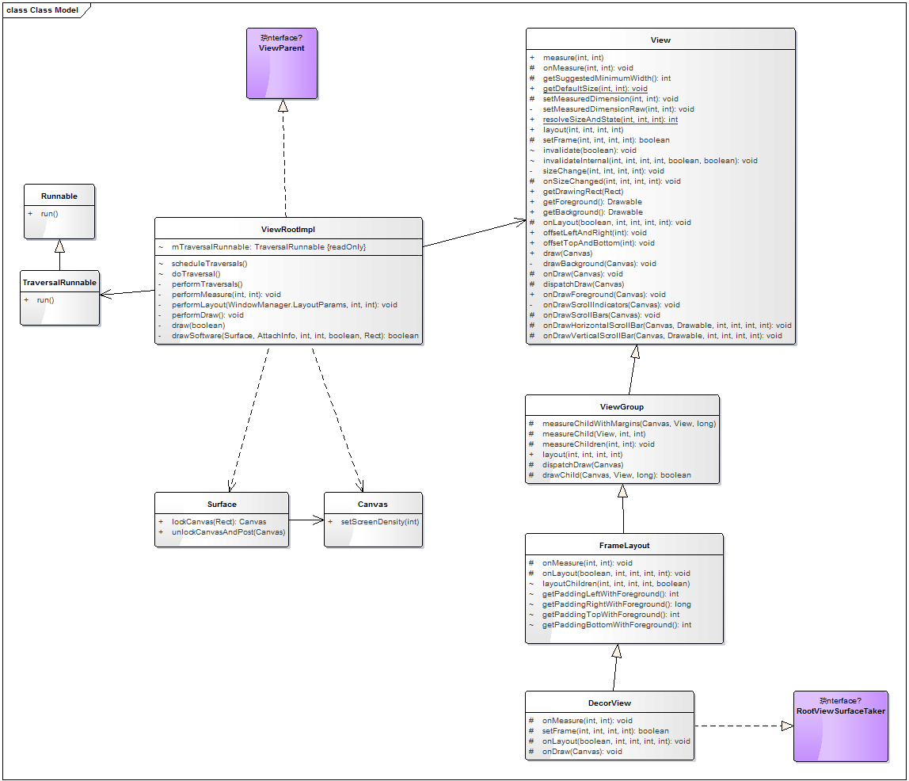

# UI机制

#### Activity中控件结构


有上图可知，我们的最外层的控件是DecorView，该控件包括两部分：titleView和contentView。当我们设置为全屏显示时，只会有contentView。

## ViewParentImpl类

> 该类实现了ViewParent
> 负责处理对控件measure、layout、draw过程
> 其中每次需要刷新一次时，都会调用一次scheduleTraversals()，发送一个线程TraversalRunnable给SurfaceFlinger服务渲染

<pre><code>
    final class TraversalRunnable implements Runnable {
        @Override
        public void run() {
            doTraversal();
        }
    }
    final TraversalRunnable mTraversalRunnable = new TraversalRunnable();
</code></pre>

该线程会被系统通过调用ViewParentImpl的**scheduleTraversals**()方法执行

<pre><code>
    void scheduleTraversals() {
        if (!mTraversalScheduled) {
            mTraversalScheduled = true;
            mTraversalBarrier = mHandler.getLooper().getQueue().postSyncBarrier();
            //执行一次UI流程
            mChoreographer.postCallback(
                    Choreographer.CALLBACK_TRAVERSAL, mTraversalRunnable, null);
            if (!mUnbufferedInputDispatch) {
                scheduleConsumeBatchedInput();
            }
            notifyRendererOfFramePending();
            pokeDrawLockIfNeeded();
        }
    }
</code></pre>

<pre><code>
    void doTraversal() {
        if (mTraversalScheduled) {
            mTraversalScheduled = false;
            mHandler.getLooper().getQueue().removeSyncBarrier(mTraversalBarrier);

            if (mProfile) {
                Debug.startMethodTracing("ViewAncestor");
            }

			//执行一次UI流程
            performTraversals();

            if (mProfile) {
                Debug.stopMethodTracing();
                mProfile = false;
            }
        }
    }
</code></pre>

执行顺序：scheduleTraversals()->doTraversal()->performTraversal()

**performTraversals**()开始对Activity中所有View遍历，并测量、布局、绘制每个View

<pre><code>
    private void performTraversals(){
        ...
            performMesaure(...);
        ...
            performLayout(...);
        ...
            performDraw();
        ...
    }
</code></pre>
在performTraversals方法中，会选择性的调用如下方法：
* performMeasure()执行测量操作(会调用顶部控件DecorView的测量方法measure()将测量操作依次传递下去)
* performLayout()执行布局操作(会调用顶部控件DecorView的布局方法layout()将布局操作依次传递给子控件)
* performDraw()执行绘制操作(会调用顶部控件DevorView的绘制方法draw()将绘制操作依次传递下去)
* 
以上三个方法并不是每次都会执行，当Activity中所有View的大小没改变时，是不用执行performMeasure方法的；当Activity中所有View的位置没有变化时，不会执行performLayout方法的。

在分析测量、布局、绘制的过程之前，先给一张相关类的关系图。



ViewRootImpl有一个成员变量mView，该View就是顶层控件DecorView(为PhoneWindow的内部类)，继承自FrameLayout

系统启动ui方法时序图如下：


## 测量measure

**三种模式**
> 
1. EXACTLY：精确模式（高两位为01），当指定为具体大小或者match_parent时使用此模式。
2. AT_MOST:最大值模式（高两位为10），当指定为wrap_content时使用此模式。
3. UNSPECIFIED：未指明模式（高两位为00），View想多大就多大，通常自定义控件时使用。
> 
> **测量模式哪里确定？**
> 
> 1. 由xml中的layout_width或layout_height决定。当设置为mactch_parent后者具体的px、dp时为EXACTLY；当设置warp_content时为AT_MOST。
> 2. 有用户在addView时，自己添加的LayoutParams时设置
>
> **常用方法**
> 
> 1. getMode(int measureSpec)获取高2位的int值
> 2. getSize(int measureSpec)获取低30位的int值
> 3. makeMeasureSpec(int size,int mode)构造一个MeasureSpec实例

测量通过performMeasure()将测量动作传递下去。

**容器节点的测量**

这里以DecorView/FrameLayout为例

> * View.measure()
> * FrameLayout.onMeasure()
> * ViewGroup.measureChildWithMargins()
> * child.measure()
> * resolveSizeAndState()
> * setMeasureDimension()

具体代码分析，请参考另三篇文章：FrameLayout、LinearLayout、RelativeLayout的源码分析


**叶子子节点的测量**

> * View.measure()
> * View.onMeasure()
> * View.getSuggestedMinimumWidth()
> * View.getSuggestedMinimumHeight()
> * View.getDefaultSize()获取控件的默认大小
> * View.setMeasuredDimension()

<pre><code>
    protected int getSuggestedMinimumWidth() {
    	//是否设置了背景图片?若设置了，则取背景图片的宽度与控件默认宽度的较大值；否则取控件的默认宽度。
        return (mBackground == null) ? mMinWidth : max(mMinWidth, mBackground.getMinimumWidth());
    }
    
    protected int getSuggestedMinimumHeight() {
    	//是否设置了背景图片?若设置了，则取背景图片的宽度与控件默认宽度的较大值；否则取控件的默认高度
        return (mBackground == null) ? mMinHeight : max(mMinHeight, mBackground.getMinimumHeight());

    }
    
    //size为默认大小，measureSpec为父控件传递过来的大小和测量模式
    public static int getDefaultSize(int size, int measureSpec) {
        int result = size;
        int specMode = MeasureSpec.getMode(measureSpec);
        int specSize = MeasureSpec.getSize(measureSpec);

        switch (specMode) {
        case MeasureSpec.UNSPECIFIED:
            result = size;//测量模式:未指明，则使用默认大小(即要多少给多少)
            break;
        case MeasureSpec.AT_MOST:
        case MeasureSpec.EXACTLY:
            result = specSize;//测量模式:精确模式、至多模式，则使用父控件指定大小
            break;
        }
		//最后返回的测量模式都是MeasureSpec.UNSPECIFIED，即此时控件的尺寸是具体的某个值
        return result;
    }
</code></pre>

通过performMeasure()触发的测量遍历方法调用时序图如下：


## layout布局

### DecorView的布局过程

> * ViewRootImpl.performLayout()
> * View.layout()
> * DecorView.onLayout()
> * FrameLayout.onLayout()
> * FrameLayout.layoutChildren()
> * View.getOutsets()获取在Surface内部的矩形区域(需要绘制的区域)
> * View.offsetLeftAndRight()将绘制区域的左边界移到屏幕原点
> * View.offsetTopAndBottom()将绘制区域的上边界移到屏幕原点

**ViewRootImpl.performLayout()**

<pre><code>
    private void performLayout(WindowManager.LayoutParams lp, int desiredWindowWidth,int desiredWindowHeight) {
        ...
            //顶层控件，即DecorView
            final View host = mView;
        ...
            //测量顶层控件DecorView
            host.layout(0, 0, host.getMeasuredWidth(), host.getMeasuredHeight());
        ...
    }
</code></pre>

**View.lalyout()**


```
    public void layout(int l, int t, int r, int b) {
        ...
            //控件位置是否发生了变化
            boolean changed = isLayoutModeOptical(mParent) ?setOpticalFrame(l, t, r, b) : setFrame(l, t, r, b);
        ...
            //若发生了变化，重新布局
            onLayout(changed, l, t, r, b);
        ...
```


**DecorView.onLayout()**

<pre><code>
        @Override
        protected void onLayout(boolean changed, int left, int top, int right, int bottom) {
            super.onLayout(changed, left, top, right, bottom);
			//获取显示显示屏的矩形显示区域
            getOutsets(mOutsets);
			//将该控件左上角移动到显示屏的原点(即左上角)
            if (mOutsets.left > 0) {
                offsetLeftAndRight(-mOutsets.left);
            }
            if (mOutsets.top > 0) {
                offsetTopAndBottom(-mOutsets.top);
            }
        }
</code></pre>

**FramLayout.onLayout()**

<pre><code>
    @Override
    protected void onLayout(boolean changed, int left, int top, int right, int bottom) {
        //对子控件布局
        layoutChildren(left, top, right, bottom, false );
    }
</code></pre>

**FrameLayout.layoutchildren()**

<pre><code>
void layoutChildren(int left, int top, int right, int bottom,
                                  boolean forceLeftGravity) {
        final int count = getChildCount();
		//子控件显示在该控件上的x方向的范围
        final int parentLeft = getPaddingLeftWithForeground();
        final int parentRight = right - left - getPaddingRightWithForeground();
		//子控件显示在该控件上的y方向的范围
        final int parentTop = getPaddingTopWithForeground();
        final int parentBottom = bottom - top - getPaddingBottomWithForeground();
		//循环遍历可见的子控件，并对其布局
        for (int i = 0; i < count; i++) {
            final View child = getChildAt(i);
			//只对可见控件布局
            if (child.getVisibility() != GONE) {
                final LayoutParams lp = (LayoutParams) child.getLayoutParams();

                final int width = child.getMeasuredWidth();
                final int height = child.getMeasuredHeight();

                int childLeft;
                int childTop;

                int gravity = lp.gravity;
                if (gravity == -1) {
                    gravity = DEFAULT_CHILD_GRAVITY;
                }

                final int layoutDirection = getLayoutDirection();//系统的布局方式:LTR,RTL
                final int absoluteGravity = Gravity.getAbsoluteGravity(gravity, layoutDirection);//水平方向对齐
                final int verticalGravity = gravity & Gravity.VERTICAL_GRAVITY_MASK;//竖直方向对齐
				//水平方向对齐方式判定，默认左对齐。计算出子控件的左边界坐标
                switch (absoluteGravity & Gravity.HORIZONTAL_GRAVITY_MASK) {
                    case Gravity.CENTER_HORIZONTAL:
                        childLeft = parentLeft + (parentRight - parentLeft - width) / 2 +
                        lp.leftMargin - lp.rightMargin;
                        break;
                    case Gravity.RIGHT:
                        if (!forceLeftGravity) {
                            childLeft = parentRight - width - lp.rightMargin;
                            break;
                        }
                    case Gravity.LEFT:
                    default:
                        childLeft = parentLeft + lp.leftMargin;
                }
				//竖直方向对齐方式判定，默认顶部对齐。计算出子控件的上边界坐标
                switch (verticalGravity) {
                    case Gravity.TOP:
                        childTop = parentTop + lp.topMargin;
                        break;
                    case Gravity.CENTER_VERTICAL:
                        childTop = parentTop + (parentBottom - parentTop - height) / 2 +
                        lp.topMargin - lp.bottomMargin;
                        break;
                    case Gravity.BOTTOM:
                        childTop = parentBottom - height - lp.bottomMargin;
                        break;
                    default:
                        childTop = parentTop + lp.topMargin;
                }
				//对子控件布局
                child.layout(childLeft, childTop, childLeft + width, childTop + height);
            }
        }
    }
</code></pre>

**计算上下左右内边距**

<pre><code>
    int getPaddingLeftWithForeground() {
		//前景如是否可显示在padding区域?若是，则取左内边距与图片左内边距的较大值，否则取两值之和
        return isForegroundInsidePadding() ? Math.max(mPaddingLeft, mForegroundPaddingLeft) :
            mPaddingLeft + mForegroundPaddingLeft;
    }

    int getPaddingRightWithForeground() {
		//前景如是否可显示在padding区域?若是，则取右内边距与图片右内边距的较大值，否则取两值之和
        return isForegroundInsidePadding() ? Math.max(mPaddingRight, mForegroundPaddingRight) :
            mPaddingRight + mForegroundPaddingRight;
    }

    private int getPaddingTopWithForeground() {
        return isForegroundInsidePadding() ? Math.max(mPaddingTop, mForegroundPaddingTop) :
            mPaddingTop + mForegroundPaddingTop;
    }

    private int getPaddingBottomWithForeground() {
        return isForegroundInsidePadding() ? Math.max(mPaddingBottom, mForegroundPaddingBottom) :
            mPaddingBottom + mForegroundPaddingBottom;
    }
</code></pre>

### 容器的布局过程

ViewGroup的onLayout()方法是个抽象方法:


LinearLayout的测量
> * View.layout()
> * LinearLayout.onLayout();
> * LinearLayout.layoutVertical()或者LinearLayout.lalyoutHorizontal()
> * LinearLayout.setChildFrame()
> * child.layout();

RelativeLayout的测量
> * View.layout()
> * RelativeLlayout.layout()
> * child.layout()

### 叶子View的布局
叶子View只需要确定自己的显示区域即可，所以View的onLayout()是个空方法

> * View.layout()
> * View.setFrame()确定控件的显示范围
> * View.invalidate()
> * sizeChange()
> * onSizeChanged()控件大小发生改变，回调该方法，供开发者做自定义操作

**View.setFrame()**

<pre><code>
    protected boolean setFrame(int left, int top, int right, int bottom) {
        boolean changed = false;

        if (DBG) {
            Log.d("View", this + " View.setFrame(" + left + "," + top + ","
                    + right + "," + bottom + ")");
        }
		//判定上下左右四条边界是否发生了变化
        if (mLeft != left || mRight != right || mTop != top || mBottom != bottom) {
            changed = true;

            // Remember our drawn bit
            //绘制标志位
            int drawn = mPrivateFlags & PFLAG_DRAWN;

            int oldWidth = mRight - mLeft;
            int oldHeight = mBottom - mTop;
            int newWidth = right - left;
            int newHeight = bottom - top;
			//判定控件大小是否发生了变化
            boolean sizeChanged = (newWidth != oldWidth) || (newHeight != oldHeight);

            // Invalidate our old position
            //旧尺寸刷新一次
            invalidate(sizeChanged);

            mLeft = left;
            mTop = top;
            mRight = right;
            mBottom = bottom;
            mRenderNode.setLeftTopRightBottom(mLeft, mTop, mRight, mBottom);

            mPrivateFlags |= PFLAG_HAS_BOUNDS;


            if (sizeChanged) {
				//控件尺寸发生改变，用户可在子方法中做自定义操作
                sizeChange(newWidth, newHeight, oldWidth, oldHeight);
            }

            if ((mViewFlags & VISIBILITY_MASK) == VISIBLE || mGhostView != null) {
                // If we are visible, force the DRAWN bit to on so that
                // this invalidate will go through (at least to our parent).
                // This is because someone may have invalidated this view
                // before this call to setFrame came in, thereby clearing
                // the DRAWN bit.
                mPrivateFlags |= PFLAG_DRAWN;
				//新尺寸刷新一次
                invalidate(sizeChanged);
                // parent display list may need to be recreated based on a change in the bounds
                // of any child
                invalidateParentCaches();
            }

            // Reset drawn bit to original value (invalidate turns it off)
            mPrivateFlags |= drawn;

            mBackgroundSizeChanged = true;
            if (mForegroundInfo != null) {
                mForegroundInfo.mBoundsChanged = true;
            }

            notifySubtreeAccessibilityStateChangedIfNeeded();
        }
        return changed;
    }
</code></pre>

**View.sizeChange()**

<pre><code>
    private void sizeChange(int newWidth, int newHeight, int oldWidth, int oldHeight) {
		//尺寸改变回调，供子类具体实现
        onSizeChanged(newWidth, newHeight, oldWidth, oldHeight);
        if (mOverlay != null) {
            mOverlay.getOverlayView().setRight(newWidth);
            mOverlay.getOverlayView().setBottom(newHeight);
        }
        rebuildOutline();
    }
</code></pre>

通过performLayout()触发布局操作的时序图如下：


在布局过程中，需要使用到LayoutParams类及其子类，这里给出一张继承关系图.


## draw绘制

这部分是需要重点分析。

> * ViewRootImpl.performDraw()
> * ViewRootImpl.draw()
> * ViewRootImpl.drawSoftware()这里有两种，软件绘制和硬件绘制，这里只分析软件绘制
> * Surface.lockCanvas()
> * Canvas.setDensity()
> * DecorView.draw()
> * Surface.unlockCanvasAndPost()

<pre><code>
    private void draw(boolean fullRedrawNeeded) {
		//应用程序窗口的绘制表面
        Surface surface = mSurface;
        if (!surface.isValid()) {
            return;
        }

    ...
        
		//应用程序窗口的"脏"区域，即需要重新绘制的区域
        final Rect dirty = mDirty;
        if (mSurfaceHolder != null) {
            // The app owns the surface, we won't draw.
            dirty.setEmpty();
            if (animating) {
                if (mScroller != null) {
                    mScroller.abortAnimation();
                }
                disposeResizeBuffer();
            }
            return;
        }
		//是否需要绘制应用程序窗口的所有区域
        if (fullRedrawNeeded) {
            mAttachInfo.mIgnoreDirtyState = true;
            dirty.set(0, 0, (int) (mWidth * appScale + 0.5f), (int) (mHeight * appScale + 0.5f));
        }

    ...

        mAttachInfo.mTreeObserver.dispatchOnDraw();

        int xOffset = 0;
        int yOffset = curScrollY;
        final WindowManager.LayoutParams params = mWindowAttributes;
        final Rect surfaceInsets = params != null ? params.surfaceInsets : null;
        if (surfaceInsets != null) {
            xOffset -= surfaceInsets.left;
            yOffset -= surfaceInsets.top;

            // Offset dirty rect for surface insets.
            dirty.offset(surfaceInsets.left, surfaceInsets.right);
        }

    ...

        mAttachInfo.mDrawingTime =
                mChoreographer.getFrameTimeNanos() / TimeUtils.NANOS_PER_MS;
		//"脏"区域存在或者正在执行动画
        if (!dirty.isEmpty() || mIsAnimating || accessibilityFocusDirty) {
            if (mAttachInfo.mHardwareRenderer != null && mAttachInfo.mHardwareRenderer.isEnabled()) {
                // If accessibility focus moved, always invalidate the root.
                boolean invalidateRoot = accessibilityFocusDirty;

                // Draw with hardware renderer.
                mIsAnimating = false;

                if (mHardwareYOffset != yOffset || mHardwareXOffset != xOffset) {
                    mHardwareYOffset = yOffset;
                    mHardwareXOffset = xOffset;
                    invalidateRoot = true;
                }
                mResizeAlpha = resizeAlpha;

                if (invalidateRoot) {
                    mAttachInfo.mHardwareRenderer.invalidateRoot();
                }

                dirty.setEmpty();

                mBlockResizeBuffer = false;
                mAttachInfo.mHardwareRenderer.draw(mView, mAttachInfo, this);
            } else {
                // If we get here with a disabled & requested hardware renderer, something went
                // wrong (an invalidate posted right before we destroyed the hardware surface
                // for instance) so we should just bail out. Locking the surface with software
                // rendering at this point would lock it forever and prevent hardware renderer
                // from doing its job when it comes back.
                // Before we request a new frame we must however attempt to reinitiliaze the
                // hardware renderer if it's in requested state. This would happen after an
                // eglTerminate() for instance.
                if (mAttachInfo.mHardwareRenderer != null &&
                        !mAttachInfo.mHardwareRenderer.isEnabled() &&
                        mAttachInfo.mHardwareRenderer.isRequested()) {

                    try {
                        mAttachInfo.mHardwareRenderer.initializeIfNeeded(
                                mWidth, mHeight, mAttachInfo, mSurface, surfaceInsets);
                    } catch (OutOfResourcesException e) {
                        handleOutOfResourcesException(e);
                        return;
                    }

                    mFullRedrawNeeded = true;
                    scheduleTraversals();
                    return;
                }
				//使用软件渲染
                if (!drawSoftware(surface, mAttachInfo, xOffset, yOffset, scalingRequired, dirty)) {
                    return;
                }
            }
        }

		//如果是执行动画，则需要安排下一次UI流程
        if (animating) {
            mFullRedrawNeeded = true;
            scheduleTraversals();
        }
    }
</code></pre>

将画面显示到屏幕时，我们的画面数据都是存储在Surface对象中，该对象对应到native-Surface结构体，供硬件读取使用。

在这个方法中，这要就是获得需要重新绘制的区域（我们有时并不用刷新整个屏幕）

<pre><code>
    private boolean drawSoftware(Surface surface, AttachInfo attachInfo, int xoff, int yoff,
            boolean scalingRequired, Rect dirty) {

        // Draw with software renderer.
        final Canvas canvas;
        try {
			//需要渲染绘制的上下左右四个边界
            final int left = dirty.left;
            final int top = dirty.top;
            final int right = dirty.right;
            final int bottom = dirty.bottom;
			//创建一块画布canvas(大小为"脏"区域)
            canvas = mSurface.lockCanvas(dirty);

            // The dirty rectangle can be modified by Surface.lockCanvas()
            //noinspection ConstantConditions
            if (left != dirty.left || top != dirty.top || right != dirty.right
                    || bottom != dirty.bottom) {
                attachInfo.mIgnoreDirtyState = true;
            }

            // TODO: Do this in native
            //设置画布的像素密度
            canvas.setDensity(mDensity);
        } 
        
    ...

        try {
            ...
            try {
                canvas.translate(-xoff, -yoff);
                if (mTranslator != null) {
                    mTranslator.translateCanvas(canvas);
                }
                canvas.setScreenDensity(scalingRequired ? mNoncompatDensity : 0);
                attachInfo.mSetIgnoreDirtyState = false;
				//绘制控件DecorView
                mView.draw(canvas);

                drawAccessibilityFocusedDrawableIfNeeded(canvas);
            } finally {
                if (!attachInfo.mSetIgnoreDirtyState) {
                    // Only clear the flag if it was not set during the mView.draw() call
                    attachInfo.mIgnoreDirtyState = false;
                }
            }
        } finally {
            try {
				//将绘制好的画布提交给渲染服务开始渲染
                surface.unlockCanvasAndPost(canvas);
            } catch (IllegalArgumentException e) {
                Log.e(TAG, "Could not unlock surface", e);
                mLayoutRequested = true;    // ask wm for a new surface next time.
                //noinspection ReturnInsideFinallyBlock
                return false;
            }

            if (LOCAL_LOGV) {
                Log.v(TAG, "Surface " + surface + " unlockCanvasAndPost");
            }
        }
        return true;
    }
</code></pre>

1. 根据需要重新绘制的区域，从Surface中获得一个画布Canvas，通过lockCanvas(Rect rect)方法。
2. 根据当前系统，设置画布的像素密度给画布Canvas;
3. 将画布传递给DecorView，调用View.draw(Canvas)方法，让其将控件图形绘制到Canvas中；
4. 绘制完毕后，surface.unlockCanvasAndPost(canvas)，、Surface将画板关闭，并将画板上的数据发送给渲染服务，供硬件使用。

**DecorView的绘制**

> * DecorView.draw()
> * View.draw()
> * View.drawBackground()
> * DecorView.onDraw()绘制自身的内容
> * View.onDraw()
> * ViewGroup.dispatchDraw()绘制子控件
> * View.onDrawForeground()绘制前景
> * View.onDrawScrollIndicators()绘制滑动指示器（滑动块）
> * View.onDrawScrollBars()绘制滑动条

**叶子View的绘制**

> 1. 绘制背景
> 2. 为绘制边界保存图层
> 3. 绘制自身的内容
> 4. 绘制子控件
> 5. 绘制边界，恢复图层
> 6. 绘制装饰物(包括前景图、滑动条，滑动块等)

<pre><code>
public void draw(Canvas canvas) {
        final int privateFlags = mPrivateFlags;
        final boolean dirtyOpaque = (privateFlags & PFLAG_DIRTY_MASK) == PFLAG_DIRTY_OPAQUE &&
                (mAttachInfo == null || !mAttachInfo.mIgnoreDirtyState);
        mPrivateFlags = (privateFlags & ~PFLAG_DIRTY_MASK) | PFLAG_DRAWN;

        /*
         * Draw traversal performs several drawing steps which must be executed
         * in the appropriate order:
         *
         *      1. Draw the background 绘制背景
         *      2. If necessary, save the canvas' layers to prepare for fading  为边框提前保存图层
         *      3. Draw view's content 绘制内容
         *      4. Draw children
         *      5. If necessary, draw the fading edges and restore layers 绘制边框、重置图层
         *      6. Draw decorations (scrollbars for instance) 绘制装饰、分割线、滑动块
         */

        // Step 1, draw the background, if needed
        int saveCount;

        if (!dirtyOpaque) {
			//绘制背景
            drawBackground(canvas);
        }

        // skip step 2 & 5 if possible (common case)
        final int viewFlags = mViewFlags;
        boolean horizontalEdges = (viewFlags & FADING_EDGE_HORIZONTAL) != 0;
        boolean verticalEdges = (viewFlags & FADING_EDGE_VERTICAL) != 0;
		//如果不用绘制边界，则执行完if中内容直接返回
        if (!verticalEdges && !horizontalEdges) {
            // Step 3, draw the content
            //绘制自身内容
            if (!dirtyOpaque) onDraw(canvas);

            // Step 4, draw the children
            //绘制子控件
            dispatchDraw(canvas);

            // Overlay is part of the content and draws beneath Foreground
            if (mOverlay != null && !mOverlay.isEmpty()) {
                mOverlay.getOverlayView().dispatchDraw(canvas);
            }

            // Step 6, draw decorations (foreground, scrollbars)
            //绘制背景
            onDrawForeground(canvas);

            // we're done...
            return;
        }

        /*
         * Here we do the full fledged routine...
         * (this is an uncommon case where speed matters less,
         * this is why we repeat some of the tests that have been
         * done above)
         */

        boolean drawTop = false;
        boolean drawBottom = false;
        boolean drawLeft = false;
        boolean drawRight = false;
		//边框强度值，范围0-1，可以理解为一个缩放因子
        float topFadeStrength = 0.0f;
        float bottomFadeStrength = 0.0f;
        float leftFadeStrength = 0.0f;
        float rightFadeStrength = 0.0f;

        // Step 2, save the canvas' layers
        int paddingLeft = mPaddingLeft;

        final boolean offsetRequired = isPaddingOffsetRequired();
        if (offsetRequired) {
            paddingLeft += getLeftPaddingOffset();
        }

        int left = mScrollX + paddingLeft;
        int right = left + mRight - mLeft - mPaddingRight - paddingLeft;
        int top = mScrollY + getFadeTop(offsetRequired);
        int bottom = top + getFadeHeight(offsetRequired);

        if (offsetRequired) {
            right += getRightPaddingOffset();
            bottom += getBottomPaddingOffset();
        }

        final ScrollabilityCache scrollabilityCache = mScrollCache;
        final float fadeHeight = scrollabilityCache.fadingEdgeLength;
        int length = (int) fadeHeight;

        // clip the fade length if top and bottom fades overlap
        // overlapping fades produce odd-looking artifacts
        if (verticalEdges && (top + length > bottom - length)) {
            length = (bottom - top) / 2;
        }

        // also clip horizontal fades if necessary
        if (horizontalEdges && (left + length > right - length)) {
            length = (right - left) / 2;
        }

        if (verticalEdges) {
            topFadeStrength = Math.max(0.0f, Math.min(1.0f, getTopFadingEdgeStrength()));
            drawTop = topFadeStrength * fadeHeight > 1.0f;
            bottomFadeStrength = Math.max(0.0f, Math.min(1.0f, getBottomFadingEdgeStrength()));
            drawBottom = bottomFadeStrength * fadeHeight > 1.0f;
        }

        if (horizontalEdges) {
            leftFadeStrength = Math.max(0.0f, Math.min(1.0f, getLeftFadingEdgeStrength()));
            drawLeft = leftFadeStrength * fadeHeight > 1.0f;
            rightFadeStrength = Math.max(0.0f, Math.min(1.0f, getRightFadingEdgeStrength()));
            drawRight = rightFadeStrength * fadeHeight > 1.0f;
        }
		//记录当前图层id，在绘制完边界后需要使用该id恢复到当前图层
        saveCount = canvas.getSaveCount();

        int solidColor = getSolidColor();
        if (solidColor == 0) {
            final int flags = Canvas.HAS_ALPHA_LAYER_SAVE_FLAG;

            if (drawTop) {
				//另起一个图层用来绘制上边界
                canvas.saveLayer(left, top, right, top + length, null, flags);
            }

            if (drawBottom) {
				//另起一个图层用来绘制下边界
                canvas.saveLayer(left, bottom - length, right, bottom, null, flags);
            }

            if (drawLeft) {
				//另起一个图层用来绘制左边界
                canvas.saveLayer(left, top, left + length, bottom, null, flags);
            }

            if (drawRight) {
				//另起一个图层用来绘制右边界
                canvas.saveLayer(right - length, top, right, bottom, null, flags);
            }
        } else {
            scrollabilityCache.setFadeColor(solidColor);
        }

        // Step 3, draw the content
        // 绘制自身内容
        if (!dirtyOpaque) onDraw(canvas);

        // Step 4, draw the children
        // 绘制子控件
        dispatchDraw(canvas);

        // Step 5, draw the fade effect and restore layers
        // 绘制边界效果、恢复图层
        final Paint p = scrollabilityCache.paint;
        final Matrix matrix = scrollabilityCache.matrix;
        final Shader fade = scrollabilityCache.shader;

		//绘制上边界
        if (drawTop) {
            matrix.setScale(1, fadeHeight * topFadeStrength);
            matrix.postTranslate(left, top);
            fade.setLocalMatrix(matrix);
            p.setShader(fade);
            canvas.drawRect(left, top, right, top + length, p);
        }

		//绘制下边界
        if (drawBottom) {
            matrix.setScale(1, fadeHeight * bottomFadeStrength);
            matrix.postRotate(180);
            matrix.postTranslate(left, bottom);
            fade.setLocalMatrix(matrix);
            p.setShader(fade);
            canvas.drawRect(left, bottom - length, right, bottom, p);
        }

		//绘制左边界
        if (drawLeft) {
            matrix.setScale(1, fadeHeight * leftFadeStrength);
            matrix.postRotate(-90);
            matrix.postTranslate(left, top);
            fade.setLocalMatrix(matrix);
            p.setShader(fade);
            canvas.drawRect(left, top, left + length, bottom, p);
        }

		//绘制右边界
        if (drawRight) {
            matrix.setScale(1, fadeHeight * rightFadeStrength);
            matrix.postRotate(90);
            matrix.postTranslate(right, top);
            fade.setLocalMatrix(matrix);
            p.setShader(fade);
            canvas.drawRect(right - length, top, right, bottom, p);
        }
		//将绘制的边框图层合并到canvas中
        canvas.restoreToCount(saveCount);

        // Overlay is part of the content and draws beneath Foreground
        if (mOverlay != null && !mOverlay.isEmpty()) {
            mOverlay.getOverlayView().dispatchDraw(canvas);
        }

        // Step 6, draw decorations (foreground, scrollbars)
        //绘制前景，包括前景图、滑动条、滑动块
        onDrawForeground(canvas);
    }

</code></pre>

**drawBackground绘制背景**

<pre><code>
private void drawBackground(Canvas canvas) {
        final Drawable background = mBackground;
        if (background == null) {
            return;
        }

        setBackgroundBounds();

        // Attempt to use a display list if requested.
        if (canvas.isHardwareAccelerated() && mAttachInfo != null
                && mAttachInfo.mHardwareRenderer != null) {
            mBackgroundRenderNode = getDrawableRenderNode(background, mBackgroundRenderNode);

            final RenderNode renderNode = mBackgroundRenderNode;
            if (renderNode != null && renderNode.isValid()) {
                setBackgroundRenderNodeProperties(renderNode);
                ((DisplayListCanvas) canvas).drawRenderNode(renderNode);
                return;
            }
        }

		//scrollTo/scrollBy造成的x、y方向的偏移量
        final int scrollX = mScrollX;
        final int scrollY = mScrollY;
        if ((scrollX | scrollY) == 0) {
			//没有偏移，直接绘制背景
            background.draw(canvas);
        } else {
        	//有偏移，将画板原点移动到偏移点后绘制背景，然后原点恢复。
        	//注意:这里只是影响了绘制的坐标，但是逻辑坐标还是原来的位置(即控件的位置并没有移动)
            canvas.translate(scrollX, scrollY);
            background.draw(canvas);
            canvas.translate(-scrollX, -scrollY);
        }
    }
</code></pre>

**onDraw绘制自身**

> View默认是空方法，需要具体View自己实现，自定义的自绘控件都是重写该方

**onDrawForeground绘制前景**

> 主要包括：
> 1. 绘制滑动块
> 2. 绘制滑动条
> 3. 绘制前景色

<pre><code>
public void onDrawForeground(Canvas canvas) {
    	//绘制滑动块
        onDrawScrollIndicators(canvas);
		//绘制滑动条
        onDrawScrollBars(canvas);
		//绘制前景图
        final Drawable foreground = mForegroundInfo != null ? mForegroundInfo.mDrawable : null;
        if (foreground != null) {
            if (mForegroundInfo.mBoundsChanged) {
                mForegroundInfo.mBoundsChanged = false;
                final Rect selfBounds = mForegroundInfo.mSelfBounds;
                final Rect overlayBounds = mForegroundInfo.mOverlayBounds;

                if (mForegroundInfo.mInsidePadding) {
                    selfBounds.set(0, 0, getWidth(), getHeight());
                } else {
                    selfBounds.set(getPaddingLeft(), getPaddingTop(),
                            getWidth() - getPaddingRight(), getHeight() - getPaddingBottom());
                }

                final int ld = getLayoutDirection();
                Gravity.apply(mForegroundInfo.mGravity, foreground.getIntrinsicWidth(),
                        foreground.getIntrinsicHeight(), selfBounds, overlayBounds, ld);
                foreground.setBounds(overlayBounds);
            }

            foreground.draw(canvas);
        }
    }
</code></pre>

**ViewGroup的绘制**

> ViewGroup绘制比View多一个绘制子控件的步骤，即dispatchDraw()方法不为空

<pre><code>
    @Override
    protected void dispatchDraw(Canvas canvas) {
        boolean usingRenderNodeProperties = canvas.isRecordingFor(mRenderNode);
		//子控件的个数
        final int childrenCount = mChildrenCount;
		//子控件集合
        final View[] children = mChildren;
		//子控件集合的标志位
        int flags = mGroupFlags;
		//子控件显示是否需要动画(由标记和控制器决定)
        if ((flags & FLAG_RUN_ANIMATION) != 0 && canAnimate()) {
            final boolean buildCache = !isHardwareAccelerated();
            for (int i = 0; i < childrenCount; i++) {
                final View child = children[i];
				//该子控件是否可见
                if ((child.mViewFlags & VISIBILITY_MASK) == VISIBLE) {
                    final LayoutParams params = child.getLayoutParams();
                    attachLayoutAnimationParameters(child, params, i, childrenCount);
					//给子控件设置动画
                    bindLayoutAnimation(child);
                }
            }
			//子控件动画控制器
            final LayoutAnimationController controller = mLayoutAnimationController;
            if (controller.willOverlap()) {
                mGroupFlags |= FLAG_OPTIMIZE_INVALIDATE;
            }
			//启动子控件动画
            controller.start();

            mGroupFlags &= ~FLAG_RUN_ANIMATION;
            mGroupFlags &= ~FLAG_ANIMATION_DONE;
			//子控件动画监听器
            if (mAnimationListener != null) {
                mAnimationListener.onAnimationStart(controller.getAnimation());
            }
        }

        ...
        
        for (int i = 0; i < childrenCount; i++) {
            while (transientIndex >= 0 && mTransientIndices.get(transientIndex) == i) {
                final View transientChild = mTransientViews.get(transientIndex);
				//子控件可见或者子控件需要显示动画
                if ((transientChild.mViewFlags & VISIBILITY_MASK) == VISIBLE ||
                        transientChild.getAnimation() != null) {
                        //绘制子控件
                    more |= drawChild(canvas, transientChild, drawingTime);
                }
                transientIndex++;
                if (transientIndex >= transientCount) {
                    transientIndex = -1;
                }
            }
            int childIndex = customOrder ? getChildDrawingOrder(childrenCount, i) : i;
            final View child = (preorderedList == null)
                    ? children[childIndex] : preorderedList.get(childIndex);
            if ((child.mViewFlags & VISIBILITY_MASK) == VISIBLE || child.getAnimation() != null) {
                more |= drawChild(canvas, child, drawingTime);
            }
        }
        
        ...
        
        // Draw any disappearing views that have animations
        //绘制那些正在通过动画消失的子控件
        if (mDisappearingChildren != null) {
            final ArrayList<View> disappearingChildren = mDisappearingChildren;
            final int disappearingCount = disappearingChildren.size() - 1;
            // Go backwards -- we may delete as animations finish
            for (int i = disappearingCount; i >= 0; i--) {
                final View child = disappearingChildren.get(i);
                more |= drawChild(canvas, child, drawingTime);
            }
        }
        
        ...
        
		//当前子控件显示完毕，并且动画执行完成，发送消息给动画监听器
        if ((flags & FLAG_ANIMATION_DONE) == 0 && (flags & FLAG_NOTIFY_ANIMATION_LISTENER) == 0 &&
                mLayoutAnimationController.isDone() && !more) {
            // We want to erase the drawing cache and notify the listener after the
            // next frame is drawn because one extra invalidate() is caused by
            // drawChild() after the animation is over
            mGroupFlags |= FLAG_NOTIFY_ANIMATION_LISTENER;
            final Runnable end = new Runnable() {
               public void run() {
                   notifyAnimationListener();
               }
            };
            post(end);
        }
    }
</code></pre>

绘制单个的子控件drawChild()，里面调用View.draw()方法

<pre><code>
    protected boolean drawChild(Canvas canvas, View child, long drawingTime) {
        return child.draw(canvas, this, drawingTime);
    }
</code></pre>

绘制分发的基本流程


