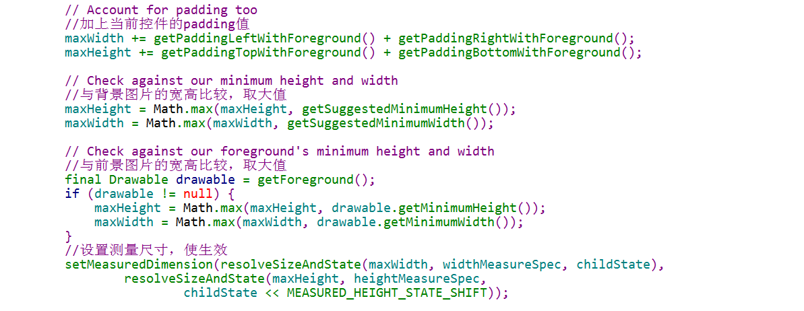

### Activity中控件结构


有上图可知，我们的最外层的控件是DecorView，该控件包括两部分：titleView和contentView。当我们设置为全屏显示时，只会有contentView。


### ViewRootImpl类
> 该类实现了ViewParent
> 负责处理对控件measure、layout、draw过程
> 其中每次需要刷新一次时，都会调用一次scheduleTraversals()，发送一个线程TraversalRunnable给SurfaceFlinger服务渲染。
TraversalRunnable定义及实现如下：

> doTraversal()->performTraversal(),在performTraversal()方法中会一次执行如下三个方法：
> 
 1. performMeasure()
 2. performLayout()
 3. performDraw()
> performMeasure()会调用顶部控件DecorView的测量方法measure()将测量依次传递下去
> performLayout()会调用顶部控件DecorView的布局方法layout()将布局一次传递给子控件。
> performDraw()会调用draw()方法，在该方法中有硬件、软件渲染两种方式，这里只分析软件渲染方法，执行drawSoftware()方法

### 测量

#### MeasureSpec
> 一个32位的int值，其中高2位为测量模式，低30位为测量值(即宽或高的像素个数)
>
> **三种模式**
> 
1. EXACTLY：精确模式（高两位为01），当指定为具体大小或者match_parent时使用此模式。
2. AT_MOST:最大值模式（高两位为10），当指定为wrap_content时使用此模式。
3. UNSPECIFIED：未指明模式（高两位为00），View想多大就多大，通常自定义控件时使用。
> 
> **测量模式哪里确定？**
> 
> 1. 由xml中的layout_width或layout_height决定。当设置为mactch_parent后者具体的px、dp时为EXACTLY；当设置warp_content时为AT_MOST。
> 2. 有用户在addView时，自己添加的LayoutParams时设置
>
> **常用方法**
> 
> 1. getMode(int measureSpec)获取高2位的int值
> 2. getSize(int measureSpec)获取低30位的int值
> 3. makeMeasureSpec(int size,int mode)构造一个MeasureSpec实例

performMeasure->measure->onMeasure

#### 容器的测量
因DecorView继承自FrameLayout，主要实现在onMeasure方法中，主要分为4步：
> 1. 测量所有子控件的宽高
> 2. 比较子控件的宽高，去最大值,并加上padding值、与前景图宽高比较取较大值、与背景图比较取较大值
> 3. 将计算的宽高设置给DecorView，使生效（即设置给成员变量，布局的时候会使用）
> 4. 如果该容器测量模式为warp_content，并且存在测量模式为match_parent的子控件，那么对设置为match_parent的子控件进行再次测量
> 

> measureChildWithMargins->getChildMeasureSpec确定子控件的MeasureSpec


> 确定好子控件的MeasureSpec后，将该MeasureSpec传递给子控件测量，使子控件确定自己的宽高

> 
> 上图中setMeasuredDimension()方法将测量好的宽高给DecorView的成员变量，表示测量完成。

> 
> 上图为对指定的子控件进行二次测量，测量时考虑前景图的padding值
#### 叶子控件的测量
> measure->onMeasure->getSuggestedMinimumWidth->getDefaultSize->setMeasuredDimension
> getSuggestedMinimumWidth:获得背景图片的高度
> getDefaultSize:获得默认大小，当测量模式为UNSPECIFIED为背景图片大小，否则为xml中给定的大小
> 
> 
> 


***控件的大小是由MeasureSpec决定，而MeasureSpec是由父控件的MeasureSpec和自身的LayoutParams决定***

### 布局

布局是在ViewRootImpl类中performLayout()启动的，里面调用了顶层控件DecorView.layout()方法，将布局传递给子控件

容器的测量
> 这里以DecorView为例，该控件继承自FrameLayout。
> layout->setFrame->onLayout->layoutChildren->child.layout
> 在setFrame中确定控件(综合考虑内容大小、前景图大小、背景图大小)的位置、大小以及是否发生了变化，当发生了变化会调用方法onSizeChanged方法，用户可在次方法中做操作，如横竖屏切换。
> 
> 
> 
> 
在layoutChildren方法中，处理子控件显示的x/y方法的范围、对齐方式，并将计算好的值传递给子控件
> 
> 

### 绘制

>绘制是在ViewRootImpl类中plerformDraw启动的，调用顺序
performDraw->draw->
draw方法中有两种渲染方式：硬件、软件渲染，这里只分析软件渲染。
draw->drawSoftware
在drawSoftware方法中，在绘制之前需要拿到画板Canvas，通过Surface中lockCanvas获得，当绘制完成后再通过Surface中unlockCanvasAndPost将画布提交SurfaceFlinger服务中进行渲染。通过DecorView.draw(canvas)将绘制传递给控件及其子控件。
在draw方法总会依次做如下操作：

1. 绘制背景
2. 保存边框图层，为绘制边框做准备
3. 绘制自身内容
4. 绘制子控件，即将绘制传递给子控件
5. 将边框图层合并，并绘制边框效果
6. 绘制前景，包括滑动指示、滑动条等
> 以下分析不考虑边框。
draw方法部分代码：

drawBackgroud方法最后是绘制背景图Drawable.draw()
onDraw方法针对容器是个空方法
dispatchDraw绘制可见的、正在执行动画的子控件，调用drawChild->child.draw来1启动绘制子控件
onDrawForeground依次调用onDrawScrollIndicators绘制滑动指示、onDrawScrollBars绘制滑动条（包括水平、竖直滑动条）


#### FrameLayout测量分析
1. 遍历子控件测量一次
2. 通过比较子控件宽高，最终确定FrameLayout的宽高（当FrameLayout为wrap_content时，FrameLayout宽高是子控件的最大宽高值）
3. 当FrameLayout为wrap_content并且子控件为match_parent，最这些子控件进行第二次测量
```
for(遍历子控件){
	测量子控件
	得出子控件最大宽高值
	if(FrameLayout为wrap_content时){
		将子控件为match_parent加入到集合中，为二测测量做准备
	}
}
FrameLayout.setMeasureDimension(width,height)
for(遍历前面收集的子控件){
	第二次测量这些子控件
}
```


#### LinearLayout测量分析
1. 忽略权重遍历子控件测量一次，来确定子控件的基础尺寸
2. 通过子控件的基础尺寸以及自身的MeasureSpec、LayoutParams，来确定LinearLayout的最终尺寸
3. 通过LinearLayout的最终尺寸得出剩余尺寸（即没有分配出去的，可为负值）
4. 根据子控件的权重从LinearLayout中在此分配到尺寸，子控件原尺寸加上新分配尺寸重新测量
```
 for(循环遍历子控件){
     mTotalLength=0已分配的高度值
     剔除子控件
     剔除GONE控件
     加上分割线高度
     累加权重
     if(LinearLayout测量模式为EXACTLY&&child高度为0&&权重为0){
         已分配的总高度+=child的margin值
     }else{
         if(child高度>0&&权重>0){
             记住child的高度值，将child高度设置为wrap_content
         }
         测量child
         将child高度恢复
         child分配的高度加上自己的margin值
         累加已分配的总高度mTotalLength
     }
     mTotalLength累加padding值
     剩余高度delta=LinearLayout高度-已经分配的高度
     for(){
         子控件新获得的高度share=delta*子控件权重
         if(LinearLayout测量模式不为EZACTLY||child高度不为0){
             子控件二次测量
         }else{
             之前高度为0的子控件进行第一次测量
         }
         获得子控件的最大宽度
     }
     LinearLayout.setMeasureDimemsion(width,height)
 }
```


#### RelativeLayout
1. 对子控件排序：子控件代表节点，节点之间的关系就是一张“图”，根据节点间的依赖关系，将“图”转化为一个队列(通过将依赖关系一个个去掉，使节点变成孤立的)
2. 遍历子控件确定子控件的宽以及一条水平边界（left后者right），计算另一条水平边界来确定子控件的水平位置
3. 遍历子控件确定子控件的高以及一条竖直边界（top或者bottom），计算另一条竖直边界来确定子控件的竖直位置
4. 通过子控件的位置，来确定RelativeLayout的大小
5. 因RelativeLayout已经改变，此时再次遍历子控件修正子控件的大小（主要是居中，对RelativeLayout右侧或者底部、Gravity）

```
onMeasure
    soreChildren()
        getSortedViews()按竖直方向排序
			findRoots()找到所有根节点
			以根节点开始，依据水平依赖关系对节点进行排序
		getSortedViews()按水平方向排序
			findRoots()找到所有根节点
			以根节点开始，依据竖直依赖关系对节点进行排序
	for(水平遍历子控件){
		applyHorizontalSizeRules()
		measureChildHorizonta()
		positionChildHorizontal()
	}
	for(竖直遍历子控件){
		applyVerticalSizeRulses()
		measureChild()
		positionChildVertical()
	}
	计算RelativeLayout的最终宽高
	for(遍历子控件){
		对居中、与父控件底部对齐的子控件修正边界
	}
	...
	RelativeLayout.setMeasureDimension(width,height)
```
