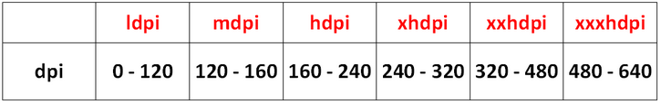
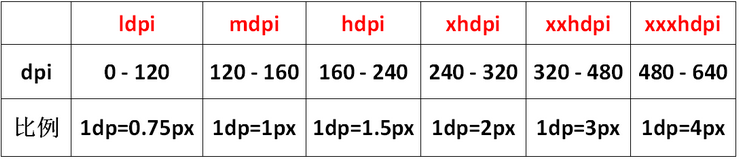
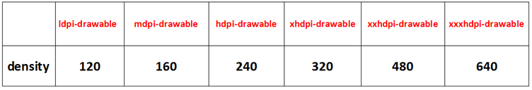
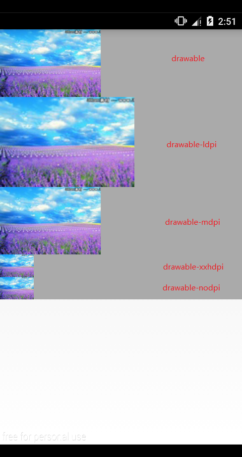
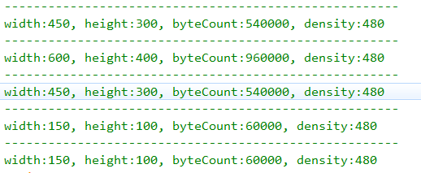

##Android中度量单位
**inch**
> inch即为英寸，它表示设备的物理屏幕的对角线长度。

**px**
> pixel简称为px，它表示屏幕的像素，也就是大家常说的屏幕分辨率。

**pt**
> pt类似于px，但常用于字体的单位

**dpi**
> dot per inch简称为dpi，它表示每英寸上的像素点个数，所以它也常为屏幕密度。
> 

**dp**
> density-independent pixel简称为dip或者dp,它表示与密度无关的像素。
> 

**sp**
> scale-independent pixel简称为sp，它类似于dp，但主要用于表示字体的大小

**TypedValue **
> 尺寸度量单位转换的类。
> 根据图片在不同drawable文件中，给予不同的density值，其中这些值以mdpi为标准1px=1dp
> 
> 注意：
> 
> 1. 在drawable文件夹下的图片，没有指定density，会使用mdpi的density来显示
> 
> 2. 在drawable-nodpi文件夹下的图片，没有指定density，会使用当前设备的density来显示
> 
> 3. 当没有与当前设备的density一致的图片存在，那么会优先使用高分辨率图片替代（即density高的文件夹中的图片,xxxhdpi->xxhdpi->xhdpi->hdpi->mdpi->ldpi）

##drawable图片的加载##
> 将一张分辨率150*100的图片分别放在如下文件夹中显示，该设备的density=3(即匹配xxhdpi文件夹)结果如图：
> 
> 通过如图得出如下结论：
> 
> 1. 发现在density越小的文件夹中显示的图片越大
> 
> 2. 在drawable文件夹中的图片与drawable-mdpi中显示的一样
> 
> 3. 在drawable-nodpi文件夹中的图片与drawable-xxhdpi中显示的一样，即与当前设备的denstity一致

>以上图片显示后获取的属性如下：
>
> 
> 
> 通过上图可得出计算公式(单位：px)：
> 
> 图片显示的宽/高=图片的原始宽高*设备的density/图片所在文件夹的density
> 
> 如：drawable-ldpi中的图片，图片原始宽150px，设备density=480，图片所在文件夹density=120，最终结果：\
> 
> 显示的宽width=150*480/120=600px

